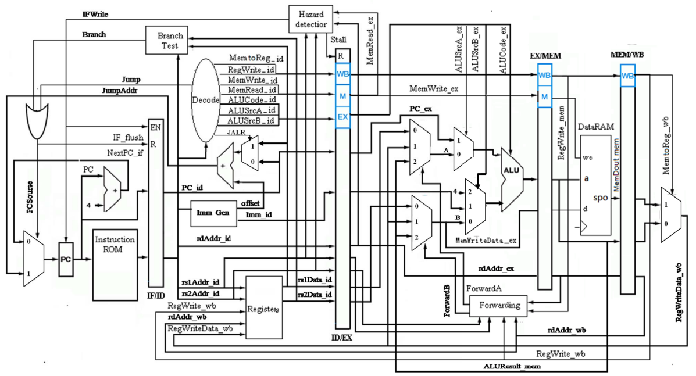
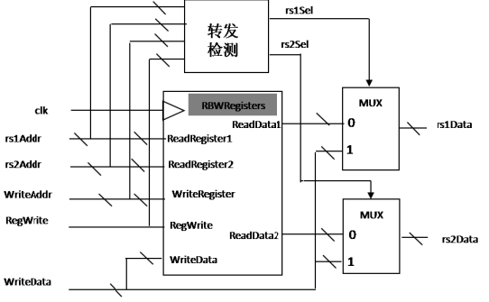
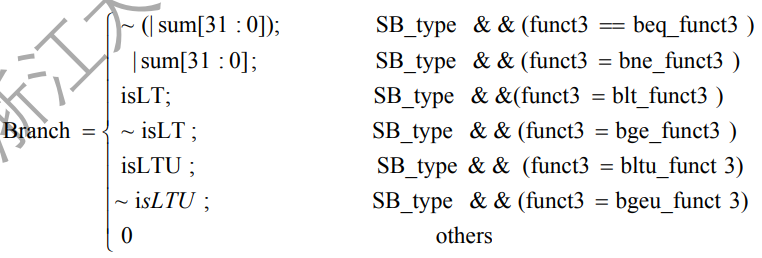
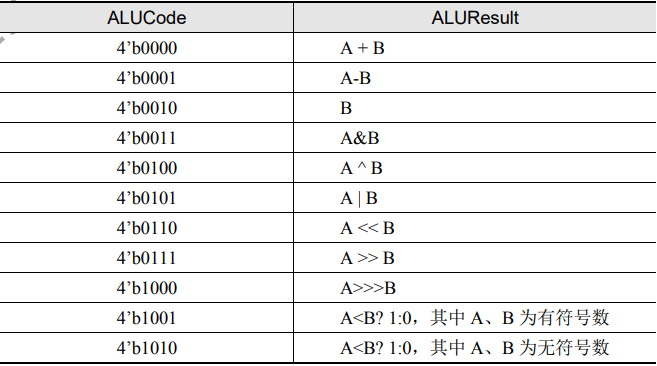
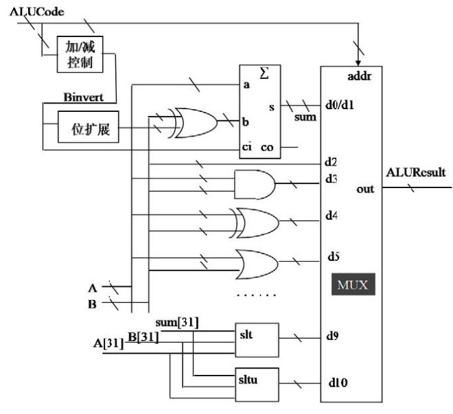

# RISC-V
This is a simple but fully developed RISC-V based CPU using verilog.

# File Level
Under ./src are covered the verilog files needed for constructing the CPU. The debugging or running files for each layer, e.g. ID_ is suffixed with `_tb`.
Under ./sim and ./vivado201704 are some files needed and generated when I ran the simulation. However, unfortunately, I have forgot some of the settings because it has been quite a few years ago. The simulation softwares are modelSim and vivado.

# The Structure of the CPU
Overall, the structure is divided into four sub-sections, i.e. IF (instruction fetch), ID (instruction decoder), EX (excution), MEM (Memory) and WB (Writing back). The last two are included in the top file ./src/riscv and the first three are written individually.
The constructed RISCV CPU is as the image:


# Some Details
## ID
Instruction Decoder is mainly composed of registers, decoder, hazard detector, branch test and quite a few adders.

### Registers
The registers should solve 3-order data hazard and has the RAW (read after write) characteristic. The sturecture is as the image below:

The RBW is a read-before-write register. For rs1Sel and rs2Sel, the verilog expressions are: 
```verilog
rs1Sel = RegWrite && (WriteAddr != 0) && (WriteAddr == rs1Addr)
rs2Sel = RegWrite && (WriteAddr != 0) && (WriteAddr == rs2Addr)
```

### Decoder
Actually quite simple, we just make a judgement on which the final operation code equals to. But be careful about the some instructions that require writing back, some insturctions that require unconditional jump and so on. These instructions need to send out the flag to trigger corresponding following action.

### Branch Test
To verify whether the branching requirements are satisfied. Here we employed a 32-bit adder to build it. To simplify, the deterministic equation should be:


### Hazard Detector
To simplify, when the hazard is triggered: 
1. the former instruction must be lw (MemRead_ex=1)
2. two instructions will read or write the same register (rdAddr_ex = rs1Addr_id or rdAddr_ex = rs2Addr_id).
Then we should clear out ID/EX register and block ID and IF pipeline.
```verilog
Stall=((rdAddr_ex==rs1Addr_id) || (rdAddr_ex==rs2Addr_id)) && MemRead_ex
IFWrite= ~Stall 
```

## EX
Basically be composed of ALU submodule, forwarding circuit and a few data selectors.

### ALU submodule
It offers the CPU the ability to shift, add, logic or, logic and compare and so on. The input should be two numbers A and B and a control code. Some of the functions with the function code is as the image:

To accelerate, we actually run the operations simultaneously and use the ALU code to select from the result.
The overall structure is as the image:


### Data Forwarding
The equation should be:
```verilog
ForwardA[0] = RegWrite_wb && (rdAddr_wb !=0) &&
    (rdAddr_mem != rs1Addr_ex) &&
    (rdAddr_wb == rs1Addr_ex)

ForwardA[1] = RegWrite_mem && (rdAddr_mem !=0) &&
    (rdAddr_mem == rs1Addr_ex)

ForwardB[0] = RegWrite_wb && (rdAddr_wb !=0) &&
    (rdAddr_mem != rs2Addr_ex) &&
    (rdAddr_wb == rs2Addr_ex)

ForwardB[1] = RegWrite_mem && (rdAddr_mem !=0) &&
    (rdAddr_mem == rs2Addr_ex)
```

## Data RAM
Constructed using Xilinx IP core. 64 `\times` 32 bit

## IF
To simplify, there is not so much to talk about. It has PC (instruction pointer register), instruction ROM (to store the data in which we have supplied a simple demo), MUX (instruction selector) and a 32-bit adder.

## Pipeline Register
Four group: 
IF/ID, ID/EX, EX/MEM, MEM/WB.

EX/MEM and MEM/WB are simple D-type registers. ID/EX is a D-type register with simultaneous reset. IF/ID needs to deal with hazard. Thus, it has the ability to hold the data still.